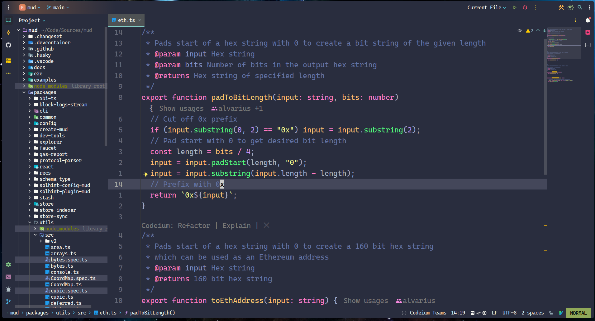
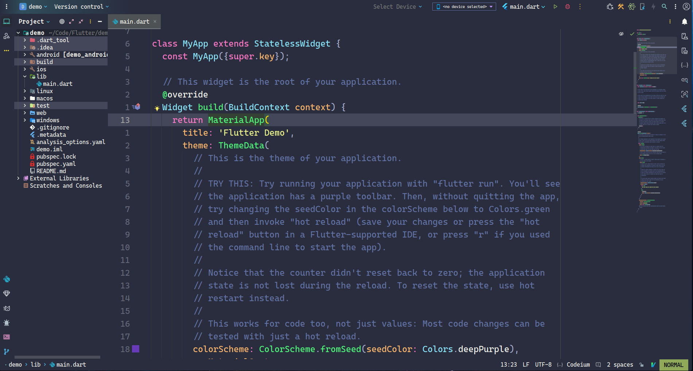

# JetbrainsIDE-config

👉 English | [简体中文](README_CN.md)





- [I. Brief Introduction 🔎](#i-brief-introduction-)
- [II. Plugins 🔌](#ii-plugins-)
- [III. Custom Configuration ☑️](#iii-custom-configuration-️)
  - [1. Appearance](#1-appearance)
  - [2. Other Settings](#2-other-settings)
- [IV. Shortcuts ⌨️](#iv-shortcuts-️)
  - [1. .ideavimrc](#1-ideavimrc)
  - [2. Shortcut Organization](#2-shortcut-organization)

> 🎯 The IDE (Integrated Development Environment) offers a comprehensive set of software development tools, including a code editor, compiler, debugger, and often includes code analysis tools, a graphical user interface (GUI) builder, and version control support. IDEs are typically language-specific or support a few languages with deep integration features like auto-completion, IntelliSense, syntax highlighting, code suggestions, and automatic refactoring. An IDE can manage the entire project lifecycle, from writing code to building, deploying, and debugging. Due to its extensive feature set, an IDE usually consumes more system resources, making startup and runtime slower.

# I. Brief Introduction 🔎

JetBrains IDEs are highly professional environments tailored to specific programming languages, known for their powerful intelligent coding assistance, debugging tools, and plugin ecosystem, all aimed at boosting developer productivity.

# II. Plugins 🔌

`AceJump`: Improves code navigation efficiency by providing a keyboard-driven alternative to mouse operations.

`Atom Material File Icons`: Offers a set of high-quality file icons that visually differentiate between various file types, enhancing both the aesthetic and usability of the interface.

`CodeGlance Pro`: Displays a thumbnail view of the entire file structure on the right side, helping developers quickly locate specific sections of code.

`Codeium: Free AI-powered code acceleration`: Integrates AI technology to offer auto-completion, smart suggestions, and code generation for developers.

`Coderpillr Theme`: A favorite customized theme that enhances the visual experience.

`Ideavim`: Integrates the powerful Vim editing capabilities into JetBrains IDE, allowing for more efficient code editing.

`IdeavimExtension`: An auxiliary plugin that extends the functionality of Ideavim by adding many features not provided by default, further enhancing Vim operations within JetBrains IDE.

`Which-Key`: A shortcut key suggestion plugin that displays available options when developers input key combinations, aiding in shortcut memorization and improving productivity.

> ⛔ Disabling unnecessary built-in plugins (often marked as “Bundled”) is an effective way to boost JetBrains IDE performance and simplify the development environment. By managing plugins wisely, you can create a more efficient and personalized development workspace.

# III. Custom Configuration ☑️

By installing essential plugins, configuring the interface layout, and editor options, along with employing a few practical tips, you can quickly tailor JetBrains IDE into a highly efficient development environment that significantly enhances productivity.

## 1. Appearance

`Appearance & Behavior -> Appearance -> Theme -> Coderpillr Dusk`

`Appearance & Behavior -> Appearance -> Editor Color Scheme -> Coderpillr Dusk`

`Appearance -> Use custom font -> Cascadia Mono PL` `Size -> 16`

Theme and Editor Color Scheme are two related but distinct concepts within an IDE. They both contribute to the overall visual appearance of the editor, but their focus areas are different.

- `Theme` refers to the overall visual style of the entire IDE, not just the code editor. This includes the toolbar, menus, sidebar, status bar, and other UI elements. It determines the window background color, button styles, icon design, and more.

- `Editor Color Scheme` focuses specifically on the color settings of the code editor area. It defines the colors for different code elements (such as keywords, strings, comments, etc.), with the primary goal of enhancing programming efficiency and comfort. By using distinct colors, it helps developers quickly identify code structures and elements.


`Appearance -> Tree Views -> Show indent guides`

Enabling this option makes it easier to recognize nested structures, especially when working on complex projects.


`Editor -> Font -> Cascadia Code NF` `Size -> 24.0`


## 2. Other Settings

`Appearance & Behavior -> System Settings -> HTTP Proxy`


`Editor -> General -> Auto import -> Add unambiguous import on the fly`

Automatically adding explicit import statements helps resolve undefined or unimported references in the code.

`Editor -> General -> Appearance -> Show whitespaces`

Additionally, rendering blank characters improves control over code formatting and readability.


# IV. Shortcuts ⌨️

The `IdeaVim` plugin allows developers to enjoy the Vim editing experience within a powerful IDE. It provides many core Vim features while being intelligently integrated with the capabilities of the IDE.

## 1. `.ideavimrc`

The `.ideavimrc` file is similar to Vim’s `.vimrc` file, used to customize Vim key bindings and behavior. You can create or edit this file in your home directory.

IdeaVim supports many Vim plugin functions, enabling you to boost productivity by adhering to Vim habits.

You can use commands like `nmap`, `vmap`, etc., to customize key mappings. Combined with JetBrains’ `:action` command, you can invoke IDE functionalities through Vim-like shortcuts.

```python
# Load NERDTree plugin
Plug 'preservim/nerdtree'
# Load vim-commentary plugin
Plug 'tpope/vim-commentary'

# Set leader key to space
let mapleader = " "

# Enable which-key functionality
set which-key
# Disable timeout, this prevents Vim from automatically aborting the input of a key combination after a long period of waiting. This gives the user more time to enter complex shortcut keys without worrying about timeouts.
set notimeout
# Enable the commentary plugin comment function
set commentary
# Enable word wrap
set wrap
# Enable easymotion functionality
set easymotion
# There will be at least 6 lines of visible buffer above and below the cursor position
set scrolloff=6
# Enable incremental search
set incsearch
# Enable search result highlighting
set hlsearch
# Ignore case when searching
set ignorecase
# Set system clipboard
set clipboard=unnamedplus
# Integrating the JetBrains IDE clipboard with the Vim clipboard allows cut, copy and paste operations to be shared between the two environments
set clipboard+=ideaput
# Show relative line numbers
set relativenumber
# Keep English input method in normal mode
set keep-english-in-normal

# next tab
nmap L <action>(NextTab)
# previous tab
nmap H <action>(PreviousTab)
# show hover info
nmap K <action>(ShowHoverInfo)

# show debug tool window
nnoremap <C-S-d> :action ActivateDebugToolWindow<CR>
# show settings
nnoremap <C-S-p> :action ShowSettings<CR>
# show terminal window
nnoremap <C-t> :action ActivateTerminalToolWindow<CR>
# close current content
nnoremap <C-w> :action CloseContent<CR>
# create new file
nnoremap <C-n> :action NewFile<CR>

# move line down
nnoremap <A-Down> :action MoveLineDown<CR>
# move line up
nnoremap <A-Up> :action MoveLineUp<CR>
# move line down in insert mode
inoremap <A-Down> :action MoveLineDown<CR>
# move line up in insert mode
inoremap <A-Up> :action MoveLineUp<CR>

# run
map <C-A-n> <Action>(Run)
# toggle full screen
map <f11> <Action>(ToggleFullScreen)

# go to previous error
nmap g[ <action>(GotoPreviousError)
# go to next error
nmap g] <action>(GotoNextError)
# go to implementation
nmap gi <action>(GotoImplementation)
# go to declaration
nmap gd <action>(GotoDeclaration)

# Code related operations
let g:WhichKeyDesc_Code = "<leader>c Code"
let g:WhichKeyDesc_Code_Format = "<leader>cf Format"
nmap <leader>cf <action>(ReformatCode) \| <action>(OptimizeImports)
let g:WhichKeyDesc_Code_Rename = "<leader>cr Rename"
nmap <leader>cr <action>(RenameElement)

# Debug related operations
let g:WhichKeyDesc_DeBug= "<leader>d Debug"
let g:WhichKeyDesc_Debug_DeBug = "<leader>db Debug"
nmap <leader>db <Action>(Debug)
let g:WhichKeyDesc_Debug_StepInto = "<leader>di StepInto"
nmap <leader>di <Action>(StepInto)
let g:WhichKeyDesc_Debug_BreakPoint = "<leader>dp BreakPoint"
nmap <leader>dp <Action>(ToggleLineBreakpoint)
let g:WhichKeyDesc_Debug_StepOver = "<leader>do StepOver"
nmap <leader>do <Action>(StepOver)
let g:WhichKeyDesc_Debug_DebugResume = "<leader>dr DebugResume"
nmap <leader>dr <Action>(Resume)
let g:WhichKeyDesc_Debug_DebugStop = "<leader>ds DebugStop"
nmap <leader>ds <Action>(Stop)
let g:WhichKeyDescepOut = "<leader>du StepOut"
nmap <leader>du <Action>(StepOut)
let g:WhichKeyDesc_Debug_BreakPointView = "<leader>dv BreakPointView"
nmap <leader>dv <Action>(ViewBreakpoints)

# NERDTree toggle
let g:WhichKeyDesc_NERDTreeToggle = "<leader>e NERDTreeToggle"
nmap <leader>e :NERDTreeToggle<CR>

# File related operations
let g:WhichKeyDesc_File = "<leader>f File"
let g:WhichKeyDesc_File_AceAction = "<leader>fa AceAction"
nmap <leader>fa <action>(AceAction)
let g:WhichKeyDesc_File_OpenFileOrFolder = "<leader>ff OpenFileOrFolder"
nmap <leader>ff <action>(ShowFilePath)
let g:WhichKeyDesc_File_AceLineAction = "<leader>fl AceLineAction"
nmap <leader>fl <action>(AceLineAction)
let g:WhichKeyDesc_Find_FindSymbol = "<leader>fo FindSymbol"
nmap <leader>fo <action>(GotoSymbol)
let g:WhichKeyDesc_File_RecentFiles = "<leader>fp RecentFiles"
nmap <leader>fp <action>(RecentFiles)
let g:WhichKeyDesc_File_QuickOpenFile = "<leader>fq QuickOpenFile"
nmap <leader>fq <action>(GotoFile)
let g:WhichKeyDesc_File_AceTargetAction = "<leader>fv AceTargetAction"
nmap <leader>fv <action>(AceTargetAction)

# Git related operations
let g:WhichKeyDesc_Git = "<leader>g Git"
let g:WhichKeyDesc_Git_GitBlame = "<leader>gb GitBlame"
nmap <leader>gb <action>(Annotate)
let g:WhichKeyDesc_Git_Diff = "<space>gd ToggleDiff"
nmap <space>gd <action>(ShowDiff)
let g:WhichKeyDesc_Git_ShowGitLog = "<leader>gg ShowGitLog"
nmap <leader>gg :action ActivateVersionControlToolWindow<CR>
let g:WhichKeyDesc_Git_Revert = "<space>gr RevertHunk"
nmap <space>gr <action>(Rollback)
let g:WhichKeyDesc_Git_Synchronize = "<leader>gs GitSynchronize"
nmap <leader>gs <action>(Synchronize)
let g:WhichKeyDesc_Git_PrevChange = "<space>g[ PrevGitChange"
nmap <space>g[ <action>(VcsPreviousChange)
let g:WhichKeyDesc_Git_NextChange = "<space>g] NextGitChange"
nmap <space>g] <action>(VcsNextChange)

# Panel related operations
let g:WhichKeyDesc_Panel = "<leader>p Panel"
let g:WhichKeyDesc_Panel_ShowProblem = "<leader>pd ShowProblem"
nmap <leader>pd :action ActivateProblemsViewToolWindow<CR>

# Window related operations
let g:WhichKeyDesc_Windows = "<leader>w Window"
let g:WhichKeyDesc_Windows_CloseAllEditors = "<leader>wc Close all tabs"
nmap <leader>wc <action>(CloseAllEditors)
let g:WhichKeyDesc_Windows_CloseAllEditorsButActive = "<leader>wo Close other tabs"
nmap <leader>wo :action CloseAllEditorsButActive<CR>
let g:WhichKeyDesc_Windows_MoveTabLeft = "<leader>wh MoveTabLeft"
nmap <leader>wh <action>(MoveTabLeft)
let g:WhichKeyDesc_Windows_MoveTabDown = "<leader>wj MoveTabDown"
nmap <leader>wj <action>(MoveTabDown)
let g:WhichKeyDesc_Windows_MoveTabUp = "<leader>wk MoveTabUp"
nmap <leader>wk <action>(MoveTabUp)
let g:WhichKeyDesc_Windows_MoveTabRight = "<leader>wl MoveTabRight"
nmap <leader>wl <action>(MoveTabRight)

# Code folding related operations
let g:WhichKeyDesc_Zip = "<leader>z Zip"
let g:WhichKeyDesc_Zip_ZipAll = "<leader>zc CollapseAllRegions"
nmap <leader>zc <action>(CollapseAllRegions)
let g:WhichKeyDesc_Zip_unZipAll = "<leader>zo ExpandAllRegions"
nmap <leader>zo <action>(ExpandAllRegions)
```

## 2. Shortcut Organization

**Tab Navigation**

| Shortcut | Description  |
| -------- | ------------ |
| `L`      | Next Tab     |
| `H`      | Previous Tab |

**Search**

| Shortcut       | Description       |
| -------------- | ----------------- |
| `/` or `?`     | Search            |
| `shift shift`  | Universal Search  |
| `ctrl shift r` | Universal Replace |

**Quick Navigation**

| Shortcut | Description                                                         |
| -------- | ------------------------------------------------------------------- |
| `g[`     | Go to previous error or warning                                     |
| `g]`     | Go to next error or warning                                         |
| `gd`     | Go to the declaration of a variable, method, or class               |
| `gi`     | Go to the implementation of the current interface or abstract class |

**Commenting**

| Shortcut | Description            |
| -------- | ---------------------- |
| `gc`     | Comment in visual mode |
| `gcc`    | Comment in normal mode |

**Code Operations**

| Shortcut     | Description                      |
| ------------ | -------------------------------- |
| `<leader>cf` | Format code and optimize imports |
| `<leader>cr` | Rename element                   |
| `ctrl alt n` | Run                              |
| `ctrl r`     | Redo                             |

**Panel Operations**

| Shortcut       | Description                                    |
| -------------- | ---------------------------------------------- |
| `ctrl t`       | Open terminal                                  |
| `ctrl w`       | Close panel                                    |
| `<leader> p d` | Show problem panel (e.g., errors and warnings) |
| `<leader> e`   | Toggle file explorer                           |
| `ctrl shift d` | Open debug window                              |
| `ctrl shift p` | Show settings                                  |

**Debugging**

| Shortcut     | Description       |
| ------------ | ----------------- |
| `<leader>db` | Start debugging   |
| `<leader>di` | Step into         |
| `<leader>dp` | Toggle breakpoint |
| `<leader>do` | Step over         |
| `<leader>dr` | Resume debugging  |
| `<leader>ds` | Stop debugging    |
| `<leader>du` | Step out          |
| `<leader>dv` | View breakpoints  |

**File Operations**

| Shortcut     | Description             |
| ------------ | ----------------------- |
| `<leader>fa` | Execute AceAction       |
| `<leader>ff` | Open file or folder     |
| `<leader>fl` | Execute AceLineAction   |
| `<leader>fo` | Search for symbols      |
| `<leader>fp` | Recently opened files   |
| `<leader>fq` | Quick open file         |
| `<leader>fv` | Execute AceTargetAction |

> `AceAction`: Basic character jump;
> `AceLineAction`: Inline jump;
> `AceTargetAction`: Quick select target word.

**Window Operations**

| Shortcut     | Description              |
| ------------ | ------------------------ |
| `<leader>wc` | Close all tabs           |
| `<leader>wo` | Close other tabs         |
| `<leader>wh` | Split panel to the left  |
| `<leader>wj` | Split panel downwards    |
| `<leader>wk` | Split panel upwards      |
| `<leader>wl` | Split panel to the right |

**Code Folding**

| Shortcut     | Description              |
| ------------ | ------------------------ |
| `<leader>zo` | Unfold all code sections |
| `<leader>zc` | Fold all code sections   |
