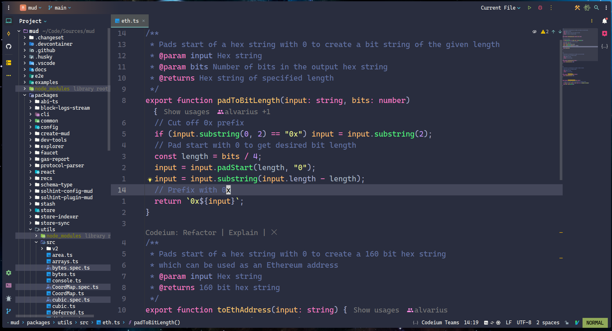
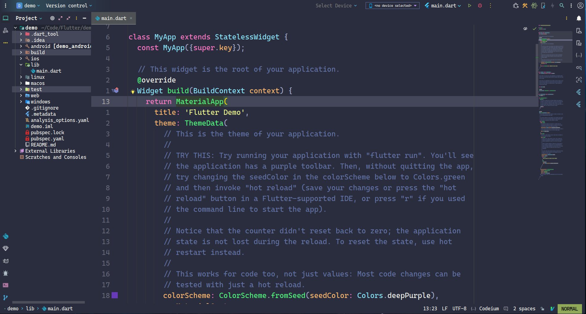

# Jetbrains IDEs 配置

👉 [English](README.md) | 简体中文





> 🎯 IDE（Integrated Development Environment，集成开发环境）提供了一整套的软件开发工具，包括代码编辑器、编译器、调试器和通常还包括代码分析工具、图形用户界面（GUI）构建器以及版本控制等。它们通常特定于一种或几种编程语言，并提供对应语言的深度集成支持，例如自动完成、智能感知、语法高亮、代码建议、自动重构等。IDE 能够处理项目的整个生命周期，从编写代码到构建项目、部署和调试。IDE 由于集成了大量功能，因此通常占用更多的系统资源，启动和运行可能较慢。

# 一、简单介绍 🔎

Jetbrains 系列是集成开发环境，专业度很高，针对不同的开发语言有独立的工具，以其强大的智能编码辅助、调试工具和插件生态系统而著称，帮助开发者提高生产力。

# 二、插件 🔌

`AceJump`：通过提供一个键盘驱动的方式来代替鼠标操作，提升代码导航的效率。

`Atom Material File Icons`：提供了一套高质量的文件图标，这些图标能够直观地显示项目中的不同文件类型，提升界面美观性和文件识别效率。

`CodeGlance Pro`：通过右侧的缩略图展示整个文件的结构，帮助开发者快速定位代码位置。

`Codeium: Free AI-powered code acceleration`：通过集成 AI 技术，它能够为开发者提供代码自动补全、智能建议和代码生成功能。

`Coderpillr Theme`：个人非常喜欢的一款定制主题。

`Ideavim`：将 Vim 的强大编辑能力集成到 JetBrains IDE 中，让开发者可以更高效地进行代码编辑。

`IdeavimExtension`：为 Ideavim 插件提供扩展功能的辅助插件，它添加了许多 Ideavim 默认不提供的功能，进一步增强了 Vim 操作与 JetBrains IDE 的兼容性。

`Which-Key`：一个快捷键提示插件，能够在开发者输入组合键时，显示该组合键的可选操作，帮助用户记忆和使用快捷键，提升开发效率。

> ⛔ 禁用不需要的内置插件（内置插件通常会标记为“Bundled”）是一个提升 JetBrains IDE 性能和简化开发环境的有效方法。通过合理管理插件，您可以创建一个更加高效和个性化的开发环境。

# 三、自定义配置 ☑️

通过安装几个必备插件、配置界面布局和编辑器选项，再结合一些实用的使用技巧，即可快速打造一个得心应手的 JetBrains IDE 开发环境，显著提升开发效率。

## 1. 外观

`Appearance & Behavior -> Appearance -> Theme -> Coderpillr Dusk`

`Appearance & Behavior -> Appearance -> Editor Color Scheme -> Coderpillr Dusk`

`Appearance -> Use custom font -> Cascadia Mono PL` `Size -> 16`

Theme 和 Editor Color Scheme 是 IDE 中两个相关但不同的概念。它们共同决定了编辑器的视觉外观，但侧重点不同。

- Theme 通常指整个 IDE 的整体视觉风格，不仅包括代码编辑区，还包括工具栏、菜单、侧边栏、状态栏等 UI 元素，决定了窗口背景色、按钮样式、图标设计等。

- Editor Color Scheme（编辑器配色方案）主要关注代码编辑区域的颜色设置，定义了不同代码元素（如关键字、字符串、注释等）的颜色，它主要目的是提升编程的效率和舒适度，通过不同颜色的区分来帮助开发者更快地识别代码结构和元素。


`Appearance -> Tree Views -> Show indent guides`

启用这个选项后，你可以更容易地识别嵌套结构，特别是在查看复杂的项目时。


`Editor -> Font -> Cascadia Code NF` `Size -> 24.0`


## 2. 其他设置

`Appearance & Behavior -> System Settings -> HTTP Proxy`


`Editor -> General -> Auto import -> Add unambiguous import on the fly`

自动添加明确的导入语句，以解决代码中未定义或未导入的引用问题。

`Editor -> General -> Appearance -> Show whitespaces`

渲染出空白字符，你可以更好地控制代码的格式和可读性。


# 四、快捷键 ⌨️

IdeaVim 插件可以让开发者在强大的 IDE 中享受 Vim 风格的编辑体验。它提供了 Vim 的许多核心功能，同时还与 IDE 的特性进行了智能集成。

## 1. `ideavimrc`

`.ideavimrc`  文件类似于 Vim 的  `.vimrc`  文件，用于自定义 Vim 键绑定和行为。你可以在用户主目录下创建或编辑这个文件。

IdeaVim 支持许多 Vim 插件功能，可以尝试用 Vim 的习惯来提高生产力。

使用  `nmap`、`vmap`  等命令来自定义快捷键，结合 JetBrains 的  `:action`  命令可以调用 IDE 的功能。

```python
# 加载 NERDTree 插件
Plug 'preservim/nerdtree'
# 加载 surround 插件
Plug 'tpope/surround'

# 设置 leader 键为空格
let mapleader = " "

# 启用 which-key 功能
set which-key
# 禁用超时，使得 Vim 不会因为等待太长时间而自动放弃组合键输入。这可以让用户在输入复杂快捷键时有更充裕的时间，不用担心超时
set notimeout
# 启用 surround 功能
set surround
# 启用自动换行
set wrap
# 启用 easymotion 功能
set easymotion
# 光标位置的上方和下方至少会有6行可见的缓冲区
set scrolloff=6
# 启用增量搜索
set incsearch
# 启用搜索结果高亮
set hlsearch
# 搜索时忽略大小写
set ignorecase
# 设置系统剪贴板
set clipboard=unnamedplus
# 将 JetBrains IDE 的剪贴板与 Vim 的剪贴板集成，使得剪切、复制和粘贴操作在两个环境中共享
set clipboard+=ideaput
# 显示相对行号
set relativenumber
# 在普通模式下保持英文输入法
set keep-english-in-normal

# 下一个标签页
nmap L <action>(NextTab)
# 上一个标签页
nmap H <action>(PreviousTab)
# 显示悬浮信息
nmap K <action>(ShowHoverInfo)

# 显示调试工具窗口
nnoremap <C-S-d> :action ActivateDebugToolWindow<CR>
# 显示设置面板
nnoremap <C-S-p> :action ShowSettings<CR>
# 显示终端窗口
nnoremap <C-t> :action ActivateTerminalToolWindow<CR>
# 为关闭当前内容
nnoremap <C-w> :action CloseContent<CR>
# 重做
nnoremap <C-y> :action Editor Redo<CR>
# 新建文件
nnoremap <C-n> :action NewFile<CR>

# 向下移动行
nnoremap <A-Down> :action MoveLineDown<CR>
# 向上移动行
nnoremap <A-Up> :action MoveLineUp<CR>
# 向下移动行
inoremap <A-Down> :action MoveLineDown<CR>
# 向上移动行
inoremap <A-Up> :action MoveLineUp<CR>

# 运行
map <C-A-n> <Action>(Run)
# 切换全屏
map <f11> <Action>(ToggleFullScreen)
# 切换到左侧窗口
map <C-h> <Action>(SwitchLeft)
# 切换到右侧窗口
map <C-l> <Action>(SwitchRight)
# 切换到上方窗口
map <C-k> <Action>(SwitchUp)
# 切换到下方窗口
map <C-j> <Action>(SwitchDown)

# 跳转到上一个错误
nmap g[ <action>(GotoPreviousError)
# 跳转到下一个错误
nmap g] <action>(GotoNextError)
# 跳转到实现
nmap gi <action>(GotoImplementation)
# 跳转到声明
nmap gd <action>(GotoDeclaration)

# 代码相关操作
let g:WhichKeyDesc_Code = "<leader>c Code"
let g:WhichKeyDesc_Code_Format = "<leader>cf Format"
nmap <leader>cf <action>(ReformatCode) \| <action>(OptimizeImports)
let g:WhichKeyDesc_Code_Rename = "<leader>cr Rename"
nmap <leader>cr <action>(RenameElement)

# 调试相关操作
let g:WhichKeyDesc_DeBug= "<leader>d Debug"
let g:WhichKeyDesc_Debug_DeBug = "<leader>db Debug"
nmap <leader>db <Action>(Debug)
let g:WhichKeyDesc_Debug_StepInto = "<leader>di StepInto"
nmap <leader>di <Action>(StepInto)
let g:WhichKeyDesc_Debug_BreakPoint = "<leader>dp BreakPoint"
nmap <leader>dp <Action>(ToggleLineBreakpoint)
let g:WhichKeyDesc_Debug_StepOver = "<leader>do StepOver"
nmap <leader>do <Action>(StepOver)
let g:WhichKeyDesc_Debug_DebugResume = "<leader>dr DebugResume"
nmap <leader>dr <Action>(Resume)
let g:WhichKeyDesc_Debug_DebugStop = "<leader>ds DebugStop"
nmap <leader>ds <Action>(Stop)
let g:WhichKeyDescepOut = "<leader>du StepOut"
nmap <leader>du <Action>(StepOut)
let g:WhichKeyDesc_Debug_BreakPointView = "<leader>dv BreakPointView"
nmap <leader>dv <Action>(ViewBreakpoints)

# NERDTree 切换
let g:WhichKeyDesc_NERDTreeToggle = "<leader>e NERDTreeToggle"
nmap <leader>e :NERDTreeToggle<CR>

# 文件相关操作
let g:WhichKeyDesc_File = "<leader>f File"
let g:WhichKeyDesc_File_AceAction = "<leader>fa AceAction"
nmap <leader>fa <action>(AceAction)
let g:WhichKeyDesc_File_OpenFileOrFolder = "<leader>ff OpenFileOrFolder"
nmap <leader>ff <action>(ShowFilePath)
let g:WhichKeyDesc_File_AceLineAction = "<leader>fl AceLineAction"
nmap <leader>fl <action>(AceLineAction)
let g:WhichKeyDesc_Find_FindSymbol = "<leader>fo FindSymbol"
nmap <leader>fo <action>(GotoSymbol)
let g:WhichKeyDesc_File_RecentFiles = "<leader>fp RecentFiles"
nmap <leader>fp <action>(RecentFiles)
let g:WhichKeyDesc_File_QuickOpenFile = "<leader>fq QuickOpenFile"
nmap <leader>fq <action>(GotoFile)
let g:WhichKeyDesc_File_AceTargetAction = "<leader>fv AceTargetAction"
nmap <leader>fv <action>(AceTargetAction)

# Git 相关操作
let g:WhichKeyDesc_Git = "<leader>g Git"
let g:WhichKeyDesc_Git_GitBlame = "<leader>gb GitBlame"
nmap <leader>gb <action>(Annotate)
let g:WhichKeyDesc_Git_Diff = "<space>gd ToggleDiff"
nmap <space>gd <action>(ShowDiff)
let g:WhichKeyDesc_Git_ShowGitLog = "<leader>gg ShowGitLog"
nmap <leader>gg :action ActivateVersionControlToolWindow<CR>
let g:WhichKeyDesc_Git_Revert = "<space>gr RevertHunk"
nmap <space>gr <action>(Rollback)
let g:WhichKeyDesc_Git_Synchronize = "<leader>gs GitSynchronize"
nmap <leader>gs <action>(Synchronize)
let g:WhichKeyDesc_Git_PrevChange = "<space>g[ PrevGitChange"
nmap <space>g[ <action>(VcsPreviousChange)
let g:WhichKeyDesc_Git_NextChange = "<space>g] NextGitChange"
nmap <space>g] <action>(VcsNextChange)

# 面板相关操作
let g:WhichKeyDesc_Panel = "<leader>p Panel"
let g:WhichKeyDesc_Panel_ShowProblem = "<leader>pd ShowProblem"
nmap <leader>pd :action ActivateProblemsViewToolWindow<CR>

# 窗口相关操作
let g:WhichKeyDesc_Windows = "<leader>w Window"
let g:WhichKeyDesc_Windows_CloseAllEditors = "<leader>wc Close all tabs"
nmap <leader>wc <action>(CloseAllEditors)
let g:WhichKeyDesc_Windows_CloseAllEditorsButActive = "<leader>wo Close other tabs"
nmap <leader>wo :action CloseAllEditorsButActive<CR>
let g:WhichKeyDesc_Windows_MoveTabLeft = "<leader>wh MoveTabLeft"
nmap <leader>wh <action>(MoveTabLeft)
let g:WhichKeyDesc_Windows_MoveTabDown = "<leader>wj MoveTabDown"
nmap <leader>wj <action>(MoveTabDown)
let g:WhichKeyDesc_Windows_MoveTabUp = "<leader>wk MoveTabUp"
nmap <leader>wk <action>(MoveTabUp)
let g:WhichKeyDesc_Windows_MoveTabRight = "<leader>wl MoveTabRight"
nmap <leader>wl <action>(MoveTabRight)

# 代码折叠相关操作
let g:WhichKeyDesc_Zip = "<leader>z Zip"
let g:WhichKeyDesc_Zip_ZipAll = "<leader>zc CollapseAllRegions"
nmap <leader>zc <action>(CollapseAllRegions)
let g:WhichKeyDesc_Zip_unZipAll = "<leader>zo ExpandAllRegions"
nmap <leader>zo <action>(ExpandAllRegions)
```

## 2. 快捷键整理
